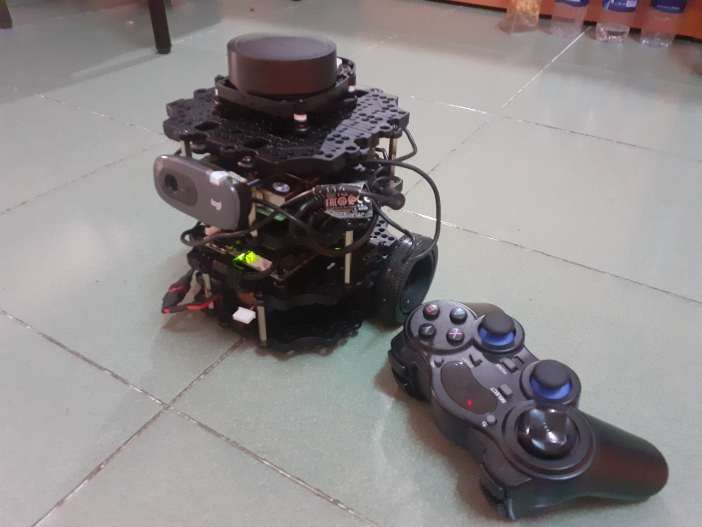
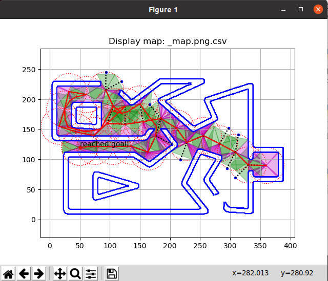

# Autonomous Robot With ROS and Web Interface

### This is a project that I am currently doing with many teachers in HCMUT. 

The aim for this project is to implementing path planner for a robot in an unknown map in real world.

Path planning in simulation

Terminal 1:
roscore

Terminal 2:
ssh ubuntu@{ip_address_of_remote_robot}

roslaunch turtlebot3_bringup turtlebot3_bringup.launch

Terminal 3:
roslaunch cse_global_planner cse-global-planner.launch
